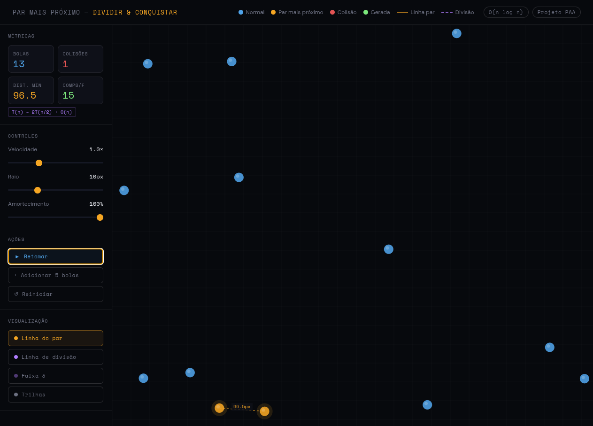
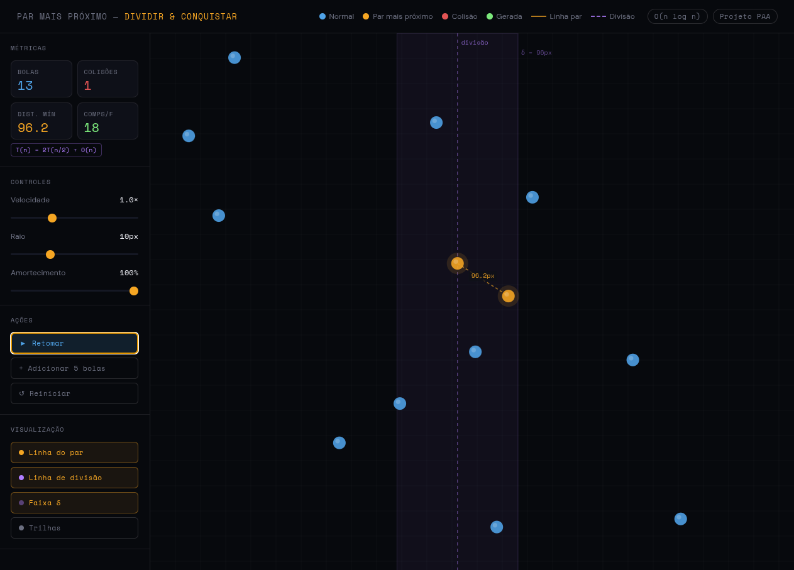

# Visualizador de Par de Pontos Mais Próximos

**Número da Lista**: XX  
**Conteúdo da Disciplina**: Dividir e Conquistar

## Alunos

| Matrícula | Aluno |
| ----- | ----- |
| 231011810 | Rodrigo Ferreira do Amaral |

## Sobre

O **Visualizador de Par de Pontos Mais Próximos** é uma simulação interativa de física construída para demonstrar o funcionamento do algoritmo **Closest Pair of Points** com a estratégia de **Dividir e Conquistar** em tempo real.

O campo é populado por bolas em movimento contínuo que colidem entre si. A cada frame, o algoritmo recalcula qual par de bolas está mais próximo e o destaca visualmente. Toda colisão gera uma nova bola no ponto de impacto, tornando a simulação progressivamente mais complexa.

* O algoritmo divide o conjunto de pontos recursivamente pelo eixo X.
* O caso base (≤ 3 pontos) usa força bruta O(n²).
* Na etapa de recombinação, apenas pontos dentro da **faixa δ** ao redor da linha de divisão são comparados, garantindo complexidade **O(n log n)** total.
* Bolas que colidem entram em um período de **cooldown** (40 frames), evitando explosões de colisões em cascata.

O projeto permite visualizar cada etapa estrutural do algoritmo: a linha de divisão vertical, a faixa δ de recombinação, a linha tracejada entre o par mais próximo e o número de comparações realizadas por frame.

## Screenshots

## Instalação

**Linguagem:** HTML5 + JavaScript (sem dependências externas)

O projeto é um único arquivo HTML autocontido. Não requer instalação, servidor local nem Node.js.

**Para rodar:**

1. Clone este repositório:
   * `git clone https://github.com/projeto-de-algoritmos-2026/G06_Dividir_e_Conquistar_PA-26.1`
   * `cd G06_Dividir_e_Conquistar_PA-26.1`

2. Abra o arquivo no navegador:
   * Dê duplo clique em `index.html`, ou
   * Linux/macOS: `index.html` / `open index.html`
   * Windows: `start index.html`

> Testado nos navegadores Chrome 120+, Firefox 121+ e Edge 120+.

## Uso

1. Ao abrir o arquivo, a simulação inicia automaticamente com 12 bolas em movimento.
2. As duas bolas do **par mais próximo** ficam destacadas em laranja, conectadas por uma linha tracejada com a distância em pixels.
3. Clique em qualquer ponto do canvas para adicionar uma nova bola naquela posição.
4. Use os controles da sidebar para personalizar a simulação:
   * **Velocidade** — multiplica a velocidade de todas as bolas (0.1× a 3×).
   * **Raio** — altera o tamanho das bolas e, consequentemente, a frequência de colisões.
   * **Amortecimento** — controla a perda de energia nas colisões (100% = elástica perfeita).
5. Use os botões de visualização para ativar/desativar camadas do algoritmo:
   * **Linha do par** — linha tracejada laranja entre o par mais próximo.
   * **Linha de divisão** — linha vertical roxa mostrando onde o conjunto é dividido.
   * **Faixa δ** — retângulo semi-transparente mostrando a região de recombinação.
   * **Trilhas** — rastro de movimento de cada bola.
6. Acompanhe as métricas em tempo real nos cards do topo da sidebar: número de bolas, colisões totais, distância mínima atual e comparações realizadas no último frame.

## Legenda de cores

| Cor | Significado |
| --- | --- |
| 🔵 Azul | Bola em estado normal |
| 🟠 Laranja | Uma das duas bolas do par mais próximo |
| 🔴 Vermelho | Bola que acabou de colidir |
| 🟢 Verde | Bola gerada por uma colisão |

## Outros

**Conceitos de Dividir e Conquistar aplicados:**

* **Divisão:** O conjunto de bolas é ordenado por coordenada X e dividido ao meio recursivamente, reduzindo o problema em subproblemas independentes.
* **Conquista (caso base):** Para grupos de até 3 pontos, o par mais próximo é encontrado por força bruta — O(n²) com n constante, portanto O(1).
* **Recombinação:** Após resolver cada metade, o algoritmo encontra o melhor δ (mínimo entre os dois lados) e inspeciona apenas os pontos dentro da faixa vertical de largura 2δ ao redor da linha de divisão. A prova geométrica garante que cada ponto verifica no máximo 7 vizinhos, mantendo a etapa de fusão em O(n).
* **Recorrência:** `T(n) = 2T(n/2) + O(n)` → pelo Teorema Mestre, caso 2: **O(n log n)**.

## Vídeo

[https://www.youtube.com/watch?v=36Esm9j4PCE](https://youtu.be/RRPOxASy3oI)
